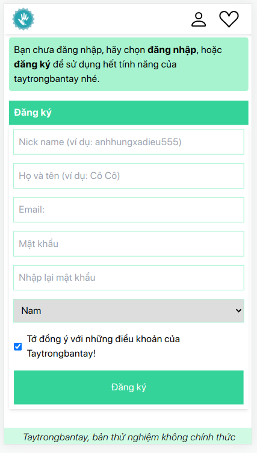
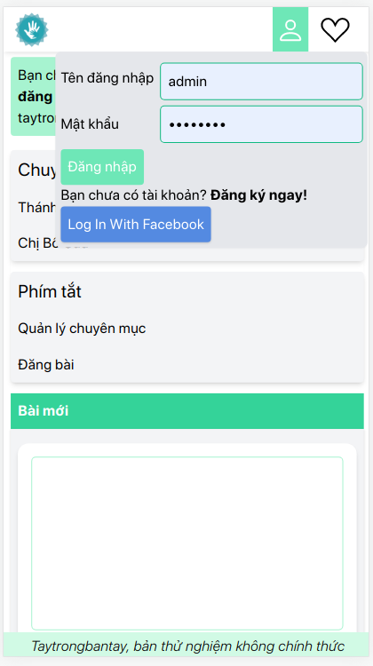
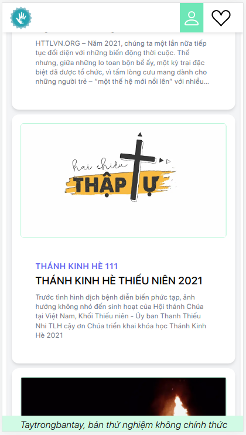
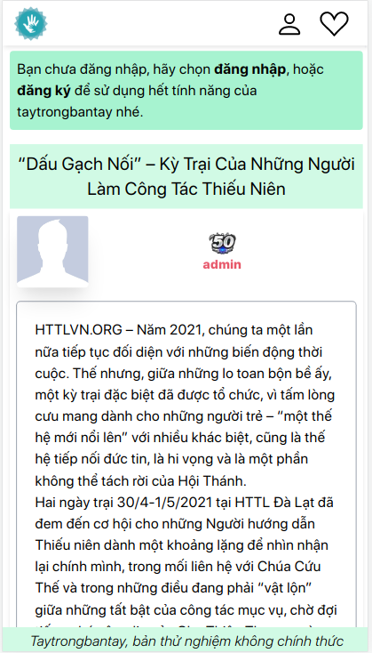
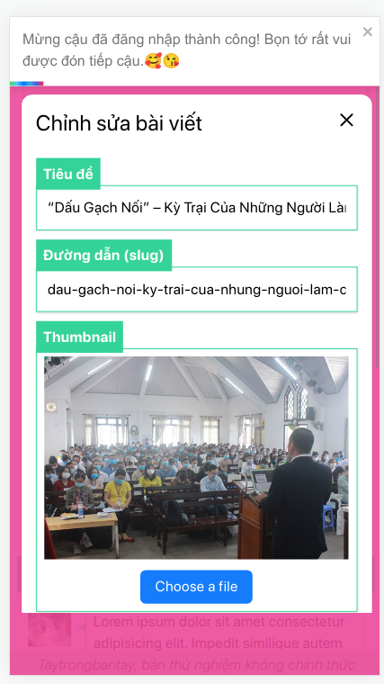
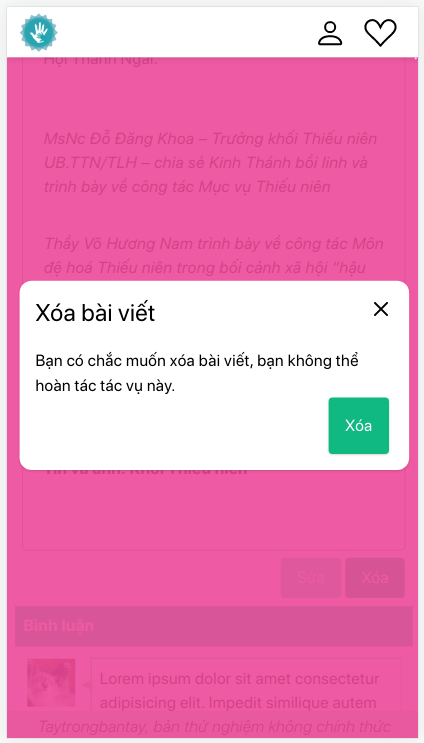
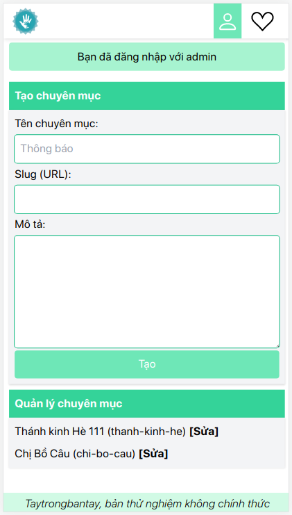
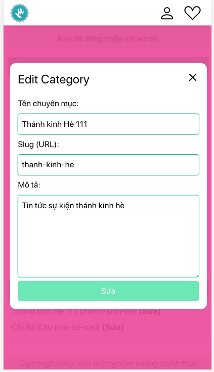

<!-- vscode-markdown-toc -->

- 1. [1.1. Công nghệ](#Cngngh)
  - 1.1. [1.1.1. Backend](#Backend)
  - 1.2. [1.1.2. Frontend](#Frontend)
- 2. [2.1. Chức năng hiện có](#Chcnnghinc)
  - 2.1. [Đăng nhập - Đăng ký](#ngnhp-ngk)
  - 2.2. [Đăng bài, sửa bài, xóa bài](#ngbisabixabi)
  - 2.3. [Admin Panel](#AdminPanel)
- 3. [2.2. Chức năng cần hoàn thiện](#Chcnngcnhonthin)
  - 3.1. [2.2.1. Backend - Nextjs](#Backend-Nextjs)

<!-- vscode-markdown-toc-config
	numbering=true
	autoSave=true
	/vscode-markdown-toc-config -->
<!-- /vscode-markdown-toc -->

# 1. Giới thiệu dự án

Website live: https://taytrongbantay.vercel.app

## 1. Công nghệ

Taytrongbantay sử dụng nextjs để có thể chạy frontend và backend trên cùng một máy, hỗ trợ trang tĩnh, server rendering cho các bài blog nhằm cải thiện SEO.

### 1.1. Backend

- [x] Nextjs
- [x] Mongodb

### 1.2. Frontend

- [x] Nextjs

# 2. Chức năng

## 2. Chức năng hiện có

### 2.1. Đăng nhập - Đăng ký

### 2.2. Đăng bài, sửa bài, xóa bài

### 2.3. Admin Panel

## 3. Chức năng cần hoàn thiện

- [x] Đăng nhập - Đăng ký
- [x] Đăng bài - Sửa bài - Xoá bài
- [ ] Admin Panel
- [ ] Bình luận
- [ ] React
- [ ] Xếp hạng thành viên
